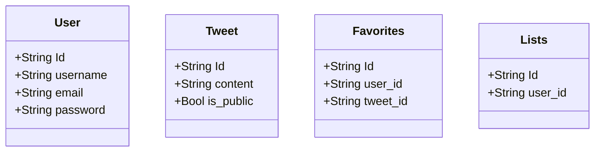

# Simple Twitter Clone

## TODO

* Mermaid
  + いい感じにグラフが書ける js plugin

* fastapi
  + query parameters
    - https://fastapi.tiangolo.com/ja/tutorial/query-params-str-validations/

* RESTful Design
  + Goto wiki

## Model

## Schema

* Pydantic
  + [ ] Pydantic Schema Validation
    - [x] Field min_length, max_length
    - [x] @validation decorator
    - [x] Raise HTTPException in Pydantic validator
    - [ ] @root_validator

## Endpoint

* users
  + [x] GET   /users
  + [x] POST  /users
  + [x] GET   /users/:user_id
  + [x] PATCH /users
  + [ ] DEL   /users

* tweets
  + [x] GET   /tweets
  + [x] POST  /tweets
  + [x] GET   /tweets/:tweet_id
  + [x] PATCH /tweets/:tweet_id
  + [ ] DEL   /tweets/:tweet_id

* favorites
  + [ ] GET  /favorites
  + [ ] POST /favorites
  + [ ] GET  /favorites/:favorite_id

* lists
  + [ ] GET  /lists
  + [ ] POST /lists
  + [ ] GET  /lists
