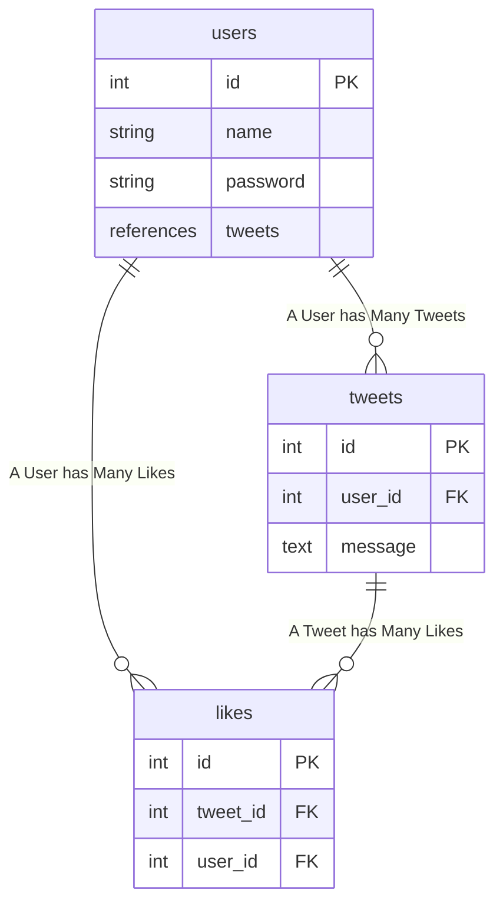

# Simple Twitter Clone

## Links

* [Endpoint Map](https://developer.twitter.com/en/docs/twitter-api/migrate/twitter-api-endpoint-map)

## Todo

* Mermaid
  + いい感じにグラフが書ける js plugin
  + これが本当にいい感じ

* fastapi
  + query parameters
    - https://fastapi.tiangolo.com/ja/tutorial/query-params-str-validations/

* RESTful Design
  + Goto wiki

* GET /tweets/:tweet_id/likes/users (あるツイートをLikeしているUserを取得 - 取得するのはUser)

## ER Diagram



## Model

```sql
sqlite> .table
likes tweets     users

CREATE TABLE likes (
        id INTEGER NOT NULL,
        user_id INTEGER NOT NULL,
        tweet_id INTEGER NOT NULL,
        PRIMARY KEY (id),
        FOREIGN KEY(user_id) REFERENCES users (id),
        FOREIGN KEY(tweet_id) REFERENCES tweets (id)
);

CREATE TABLE tweets (
        id INTEGER NOT NULL,
        message VARCHAR NOT NULL,
        user_id INTEGER NOT NULL,
        PRIMARY KEY (id),
        FOREIGN KEY(user_id) REFERENCES users (id)
);

CREATE TABLE users (
        id INTEGER NOT NULL,
        name VARCHAR NOT NULL,
        password VARCHAR NOT NULL,
        PRIMARY KEY (id)
);
```

## Schema

* Pydantic
  + [ ] Pydantic Schema Validation
    - [x] Field min_length, max_length
    - [x] @validation decorator
    - [x] Raise HTTPException in Pydantic validator
    - [ ] @root_validator

## Endpoint

* users
  + [x] GET   /users
  + [x] POST  /users
  + [x] GET   /users/:user_id
  + [x] PATCH /users
  + [x] DEL   /users

* tweets
  + [x] GET   /tweets
  + [x] POST  /tweets
  + [x] GET   /tweets/:tweet_id
  + [x] PATCH /tweets/:tweet_id
  + [x] DEL   /tweets/:tweet_id

* likes
  + [x] GET   /likes
  + [x] GET   /users/:user_id/likes/tweets (User が Like している tweets を取得)
  + [x] GET   /tweets/:tweet_id/likes/users (あるツイートをLikeしているUserを取得 - 取得するのはUser)
  + [x] POST  /tweets/:tweet_id/likes
  + [x] DEL   /tweets/:tweet_id/likes

## Todo

* [Lists](https://help.twitter.com/ja/using-twitter/twitter-lists)

> リストを使用することで、タイムラインに表示するツイートをカスタマイズ、整理、優先順位付けできます
>
> Twitterで他のユーザーが作成したリストに参加したり、自分のアカウントから、グループ、トピック、
>
> または興味関心の対象別に、他のアカウントのリストを作成したりできます
>
> リストタイムラインには、リストに登録されたアカウントのツイートのみが表示されます
>
> また、お気に入りのリストを自分のタイムラインの上部に固定しておけば
>
> 重要なアカウントからのツイートを見逃すこともありません

こんなに複雑なものはいらない

Lists/members (tweet users) があればOKかな

そこに登録されている members のツイートを一覧で表示できるみたいな機能でOK

* Tags

Twitter には message にタグと呼ばれるものを埋め込める

面倒なので作らない

## Done

### Favorite or Likes?

* [Favorites](https://developer.twitter.com/en/docs/twitter-api/v1/tweets/post-and-engage/api-reference/get-favorites-list)

* [Likes](https://developer.twitter.com/en/docs/twitter-api/tweets/likes/migrate/manage-likes-standard-to-twitter-api-v2)

なんと Favorites は古いAPIだったことが判明

現在は Likes というAPIに変わっておった すごい量の変更点が発生

修正完了 実はそこまで大したことは無かった

### 突然 Docker Compose 化

* [x] connection psql with async
* [x] test with asycn psql
* [x] migrate docker container psql
* [x] API test on Web Browser
  + [x] web broswer 上での login すると/token だけが `Not Found` エラーに!
  + test は40くらい 全部通っている auth 系も含めて
  + 1. httpie POST /token ... OK Bearer 取得できた (???)
  + 2. Web Broswer 再起動 -> authorize login 可能になった
  + 意味がわからないが修正完了

Compose 化すべて完了 3, 4 時間かかってないか

理由が判明 単純に `/token` でパスワード認証失敗すると `HTTP_404` が出るが

Detail="User Not Found" が出力されずに "Error: Not Found" という表示しか無いため

勝手に URL に API が飛んでないと勘違いしたというお話

というか status 404 は Not Foundなのでそもそも raise HTTPException がおかしいという話

Login認証失敗したら普通は 401 修正します 完全に終了

### Likes

[Likes Introduction](https://developer.twitter.com/en/docs/twitter-api/tweets/likes/introduction)

* [x] あるユーザーが Like しているTweetを全部取得
  + GET `/tweets/:tweet_id/likes/users`

* [x] GET ある Tweet に Like している User を全取得
  + GET `/tweets/:tweet_id/likes/users`

どうしてもRelationがうまくとれない
ので超ださいけど User -> User.id.in_(user_ids) で取得することに
