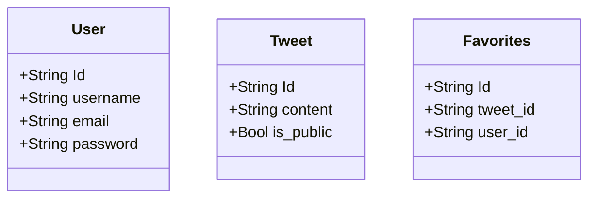

# Simple Twitter Clone
* [Endpoint Map](https://developer.twitter.com/en/docs/twitter-api/migrate/twitter-api-endpoint-map)

## TODO

* Mermaid
  + いい感じにグラフが書ける js plugin
  + これが本当にいい感じ

* fastapi
  + query parameters
    - https://fastapi.tiangolo.com/ja/tutorial/query-params-str-validations/

* RESTful Design
  + Goto wiki

## Model

## Schema

* Pydantic
  + [ ] Pydantic Schema Validation
    - [x] Field min_length, max_length
    - [x] @validation decorator
    - [x] Raise HTTPException in Pydantic validator
    - [ ] @root_validator

## Endpoint

* users
  + [x] GET   /users
  + [x] POST  /users
  + [x] GET   /users/:user_id
  + [x] PATCH /users
  + [x] DEL   /users

* tweets
  + [x] GET   /tweets
  + [x] POST  /tweets
  + [x] GET   /tweets/:tweet_id
  + [x] PATCH /tweets/:tweet_id
  + [x] DEL   /tweets/:tweet_id

* favorites
  + [ ] GET  /favorites
  + [ ] POST /favorites
  + [ ] DEL  /favorites

## TODO

* [Favorites](https://developer.twitter.com/en/docs/twitter-api/v1/tweets/post-and-engage/api-reference/get-favorites-list)

* [Lists](https://help.twitter.com/ja/using-twitter/twitter-lists)

> リストを使用することで、タイムラインに表示するツイートをカスタマイズ、整理、優先順位付けできます
> Twitterで他のユーザーが作成したリストに参加したり、自分のアカウントから、グループ、トピック、
> または興味関心の対象別に、他のアカウントのリストを作成したりできます
> リストタイムラインには、リストに登録されたアカウントのツイートのみが表示されます
> また、お気に入りのリストを自分のタイムラインの上部に固定しておけば
> 重要なアカウントからのツイートを見逃すこともありません。

こんなに複雑なものはいらない
Lists/members (tweet users) があればOKかな

そこに登録されている members のツイートを一覧で表示できるみたいな機能でOK

* Tags

Twitter には message にタグと呼ばれるものを埋め込める
面倒なので作らない
