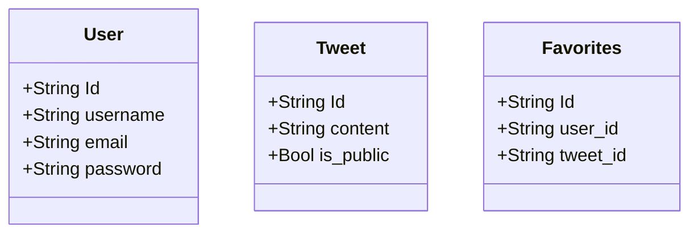

# Simple Twitter Clone

## TODO

- Mermaid
  - いい感じにグラフが書ける js plugin

- fastapi
  - query parameters
    - https://fastapi.tiangolo.com/ja/tutorial/query-params-str-validations/

## Model

## Endpoint

- users
  - GET   /users
  - POST  /users
  - GET   /users/:user_id
  - PATCH /users
  - DEL   /users

- tweets
  - GET  /tweets
  - GET  /tweets/:tweet_id
  - POST /tweets/:tweet_id/favorite

- favorites
  - GET  /favorites
  - GET  /favorites/:favorite_id
  - POST /favorites/:favorite_id

## Real Twitter API

- searching
  - https://twitter.com/search?q=nextjs&src=typed_query

- favorite
  - https://api.twitter.com/graphql/lI07N6Otwv1PhnEgXILM7A/FavoriteTweet
  - https://api.twitter.com/graphql/ZYKSe-w7KEslx3JhSIk5LA/UnfavoriteTweet

## What

- graphql
  - what?
